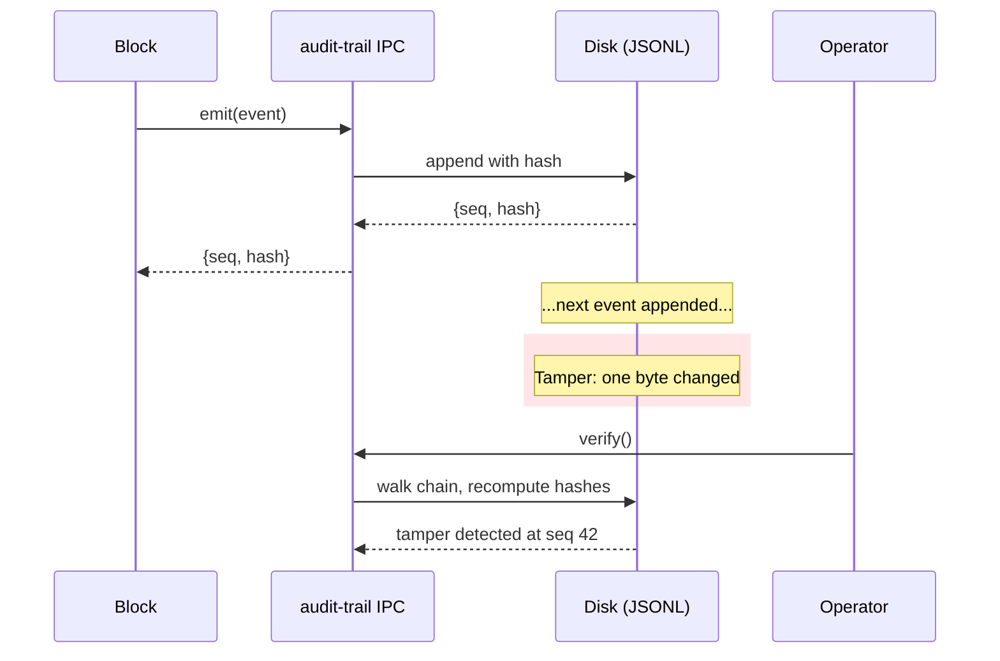

# audit-trail

[](LICENSE)
[](go.mod)
[](https://github.com/tkdtaylor/audit-trail/commits)

**A tamper-evident, hash-chained append-only forensic log.** Every block in the
Secure Agent Ecosystem emits to it. Verify it offline — the chain detects any
byte-level change, down to the bit. It records facts; it does not detect, prevent,
or alert.

It's built for **operators who need a forensic record they can trust** — one whose
integrity is verifiable without an external oracle, and whose contract is frozen
across all blocks that depend on it. Part of the
[Secure Agent Ecosystem](#ecosystem-blocks), Apache-2.0 licensed.

> **Status.** v1 contract (frozen); emit, verify, checkpoint, and rotate all working
> and tested. Signed checkpoints (RFC 6962 STH) and Rekor anchoring (v1+) are shipped.
> See [docs/CONTRACT.md](docs/CONTRACT.md).

## Contents

- [Quick start](#quick-start)
- [How it works](#how-it-works)
- [Emit and verify](#emit-and-verify)
- [Ecosystem blocks](#ecosystem-blocks)
- [Develop locally](#develop-locally)
- [Tech stack](#tech-stack)
- [Sponsorship](#sponsorship)
- [Enterprise support](#enterprise-support)
- [License](#license)

## Quick start

The fastest way to emit and verify an entry — no daemon, no dependencies:

```bash
git clone https://github.com/tkdtaylor/audit-trail && cd audit-trail
go build -o bin/audit-trail ./...

# Emit an entry to the log
./bin/audit-trail emit --logfile audit.log \
  --actor vault --action resolve --target vault://x

# Verify the chain is intact
./bin/audit-trail verify --logfile audit.log
```

The verify step exits zero on success, nonzero if tampering is detected. To run the
IPC daemon (the hot path), see [How it works](#how-it-works).

## How it works

When a block emits an event, audit-trail appends it to the log with a deterministic
hash: `SHA256(prev_hash + JCS(event))`. The hash ties each entry to the one before it
in an immutable chain. Running `verify()` walks the disk from start to finish,
recomputing every hash. If any entry's hash or its link to the previous entry doesn't
reconcile, verify stops and reports the sequence number where tampering began.



The contract is frozen at v1 — no breaking changes to emit/verify. Signed checkpoints,
witness anchoring, and rotation are optional layers behind the contract seam.

## Emit and verify

| Operation | What it does | Example |
|-----------|--------------|---------|
| `emit` | Append an event to the log. Deterministic hash-chaining; single-writer mutex. | `audit-trail emit --logfile audit.log --actor vault --action resolve --target vault://x` |
| `verify` | Walk the chain from disk and check every hash. Exits nonzero if tampering detected. | `audit-trail verify --logfile audit.log` |
| `checkpoint` | Create a signed checkpoint (RFC 6962 STH) at the current position. Optional; requires a signing key. | `audit-trail checkpoint create --logfile audit.log --log-id prod --signing-key key.pem` |
| `rotate` | Seal the current segment and start a new one. All segments verify independently; cross-segment verify stitches them. | `audit-trail rotate --logfile audit.log --log-id prod --signing-key key.pem` |
| `serve` | Run the IPC daemon on a Unix socket (the hot path for agent-builder). | `audit-trail serve --socket /run/audit.sock --logfile audit.log` |

See [docs/spec/behaviors.md](docs/spec/behaviors.md) for the complete behavior spec;
[docs/CONTRACT.md](docs/CONTRACT.md) for the frozen v1 contract.

## Ecosystem blocks

audit-trail is one block in the Secure Agent Ecosystem, composed by agent-builder
alongside vault, policy-engine, exec-sandbox, armor, and others. Each block is
standalone and independently usable.

- **[exec-sandbox](https://github.com/tkdtaylor/exec-sandbox)** — OS execution isolation
- **[vault](https://github.com/tkdtaylor/vault)** — JIT secret broker
- **[policy-engine](https://github.com/tkdtaylor/policy-engine)** — Out-of-process authorization
- **[audit-trail](https://github.com/tkdtaylor/audit-trail)** — Tamper-evident log (this block)
- **[armor](https://github.com/tkdtaylor/armor)** — LLM-guard on ingestion and tool calls
- **[dep-scan](https://github.com/tkdtaylor/dep-scan)** — Supply-chain CVE scan
- **[code-scanner](https://github.com/tkdtaylor/code-scanner)** — Malware scan

Composed together in [agent-builder](https://github.com/tkdtaylor/agent-builder#the-building-blocks).

## Develop locally

```bash
go build ./...                 # compile
go test ./...                  # run unit tests
make check                     # test + build
make fitness                   # wired integrity checks (tamper detection, canonical stability, checkpoint/rotation/anchor fixtures)
go fmt ./...                   # format
```

Contributing runs through a test-spec-first, one-task-one-branch workflow. Read
[AGENTS.md](AGENTS.md) (the canonical, harness-neutral briefing) and
[CONTRIBUTING.md](CONTRIBUTING.md) before starting; tasks and their specs live under
[docs/tasks/](docs/tasks/).

## Tech stack

Go 1.26 — standard library only. No external dependencies by design. See
[AGENTS.md](AGENTS.md#external-tools) for the external tools (Go toolchain, Make).

## Sponsorship

audit-trail is independent, open-source security tooling. If it saves you time or risk, [sponsoring its development](https://github.com/sponsors/tkdtaylor) is the most direct way to keep it maintained.

## Enterprise support

Commercial support, integration help, and SLAs are available. Apache-2.0 means you can build on audit-trail freely; paid support is a partner if you want one, never a requirement. Contact [tools@taylorguard.me](mailto:tools@taylorguard.me).

## License

[Apache License 2.0](LICENSE) — consistent with the other blocks in the Secure Agent
Ecosystem. See [NOTICE](NOTICE) for attribution and disclaimers, and
[CONTRIBUTING.md](CONTRIBUTING.md) for the inbound=outbound / DCO contribution terms.
