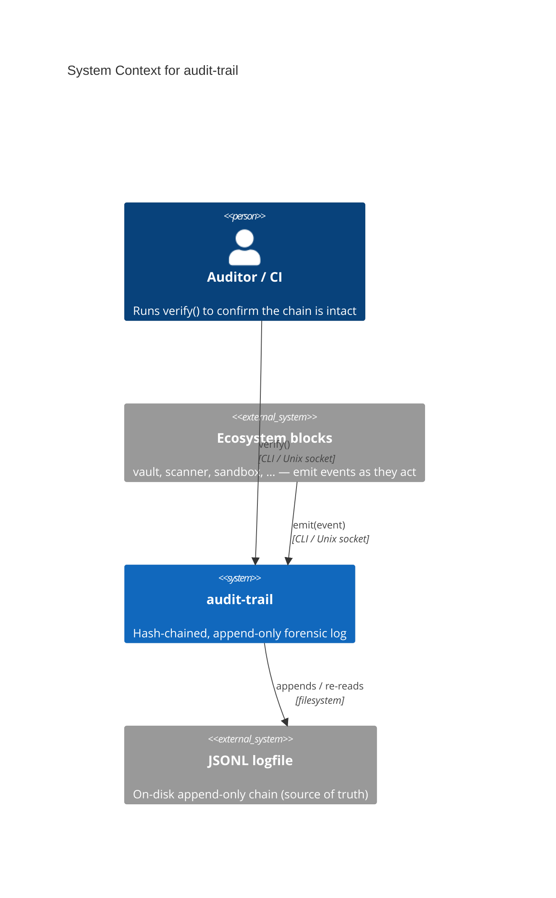
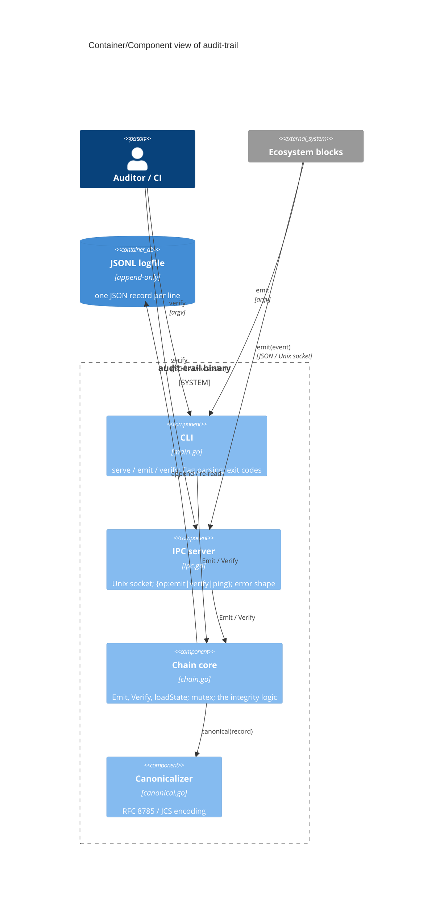
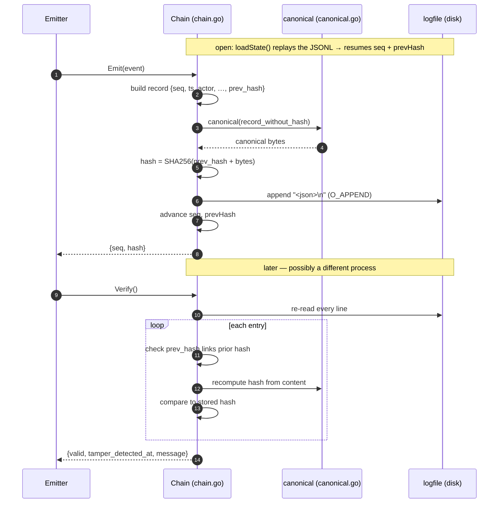

# Architecture Diagrams

**Project:** audit-trail
**Last updated:** 2026-06-03

C4-structured Mermaid diagrams plus the primary runtime flows. See [overview.md](overview.md)
for prose context, [decisions/](decisions/) for ADRs, and [`../spec/architecture.md`](../spec/architecture.md)
for the structured element catalog these diagrams render.

These diagrams are part of the **authoritative spec**. Code changes that contradict a diagram
either invalidate the change or the diagram — one must be updated to match in the same commit.

GitHub and most IDE previewers render Mermaid natively; no build step required.

> **Scaling note.** audit-trail is a single deployable unit (one binary, two transports) with
> no external dependencies, so the Container and Component levels collapse into one diagram.

---

## 1. System Context — who uses it and what it touches

> The system as one box: the ecosystem blocks that emit events, the auditor who verifies, and
> the on-disk log. No external services — integrity is offline and self-contained.

---

## 2. Container + Component — inside the binary

> One binary, one Go package. Two transports (CLI, IPC) drive the same `Chain` core, which is
> the only thing that touches the logfile.

**Key contracts**
- `Chain` is the **single writer**. One `sync.Mutex` serializes `Emit`; IPC goroutines funnel
  through it.
- `Verify()` reads the **logfile from disk**, never the in-memory `Chain` — this is what
  detects a tamper. (ADR-001)
- `canonical()` must stay byte-stable: sorted keys, no insignificant whitespace, shortest
  integers, no floats. Drift here silently breaks every hash. (ADR-001)

---

## 3. Primary runtime flow — emit then verify

---

## Adding more diagrams

Future flows worth their own numbered section as the project grows toward the v1+ roadmap:
- **Signed checkpoints (RFC 6962 STH)** — checkpoint generation + witness anchoring sequence.
- **Log rotation / checkpointing** — how a rotated segment links back to its predecessor.
- **Pluggable backends** — the emit/verify seam fronting Rekor / immudb / Postgres.

One concept per diagram. Split any diagram that mixes layout and runtime sequence.

---

## Maintaining these diagrams

- **Trigger to update:** a new transport, a new component file, a backend behind the seam, or
  an ADR that changes a diagrammed flow. Keep [`../spec/architecture.md`](../spec/architecture.md)
  in sync — the catalog and these diagrams describe the same elements.
- **Edit existing over adding new.** Duplicates rot independently.
- **Update the date at the top** when you change anything substantive.
